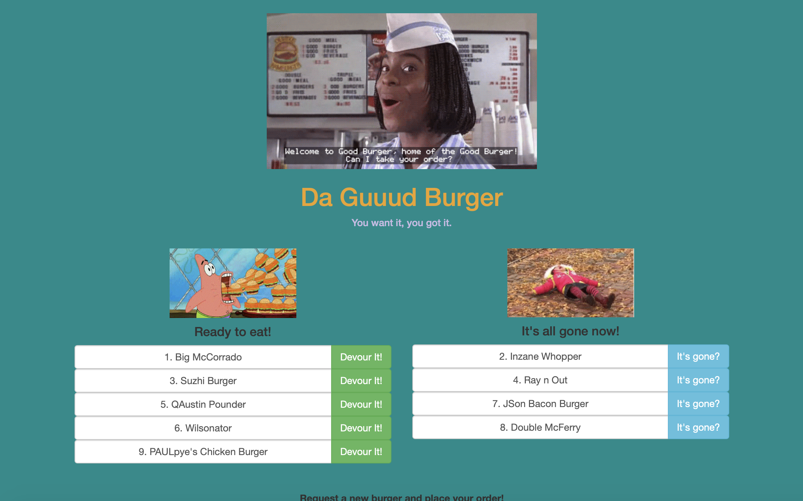

# 🗳 PROJECT NAME: Da Guuud Burger :hamburger:

# 💻 Demo 

## 🗒 Project Description 
 
 This project utilizes Node, Express, MySQL, and Handlebars to make a burger, devour it, and hear what it has to say once consumed.
 
## ✨ TABLE OF CONTENTS 

            1. Usage

            2. Languages

            3. License

 
            
## 📚 Usage 
 
 Runs on localhost:3000 and deployed via https://ancient-inlet-69035.herokuapp.com/
 
## 🙊 Languages Needed 
 
 JavaScript, Node, Express, MySQL, Handlebars
 
## 💳 License 
 
 This project is under the MIT license
 
 
## 🙌👏 Questions? 
  
This project exists thanks to this person who contributed. 
